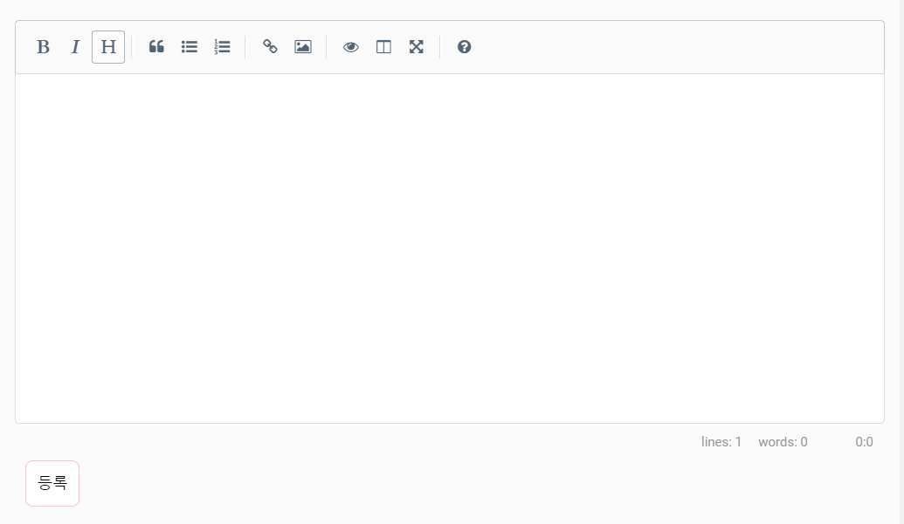

# README - by rain

## 0-4 markdown editor

### router 설정 및 views vue 생성

1. `router.js`

   ```js
   import CreatePost from './views/CreatePost.vue'
   ...
   	{
         path: '/create',
         name: 'create',
         component: CreatePost
       }
   ```

   `CreatePost.vue` 를 만들기 위해 `/create` 주소를 생성한 후, component로 CreatePost를 지정

2. `views/CreatePost.vue`

   ```html
   <template>
     <div>
       <WMHeader></WMHeader>
       <WMFooter></WMFooter>
     </div>
   </template>
   ```

   ```js
   <script>
     import WMHeader from '../components/WMHeader'
     import WMFooter from '../components/WMFooter'
     export default {
       components: {
         WMHeader,
         WMFooter,
       }
     }
   </script>
   ```

   기본 골격을 잡아놓은 후, 안에 들어갈 markdown editor component 생성.


### markdown editor component 생성

1. [vue-simplemde](<https://github.com/F-loat/vue-simplemde>) 설치

   ```bash
   npm install vue-simplemde --save
   ```

2. npm init

   + 현재 환경설정 저장

3. `components/MarkdownEditor.vue`

   ```html
   <template>
       <div>
           <markdown-editor v-model="content" ref="markdownEditor"></markdown-editor>
           <button v-on:click="goHome" id="createButton">등록</button>
       </div>
   </template>
   ```

   ```js
   <script>
     import markdownEditor from 'vue-simplemde/src/markdown-editor'
   
     export default {
       components: {
         markdownEditor
       },
       data () {
         return {
           content: '',
           configs: {
             spellChecker: false // disable spell check
           }
         }
       },
       methods: {
           goHome: function(){
           alert('저장할게요!');
           location.replace('/');
           }
       }
     }
   </script>
   ```

   ```css
   <style>
     @import '~simplemde/dist/simplemde.min.css';
   </style>
   ```

   + methods는 임시로 root 페이지로 이동할 수 있게 해두었다.

4. `CreatePost.vue`

   ```html
       <MarkdownEditor></MarkdownEditor>
   ```

   div 안 원하는 위치에 추가.

   ```js
     import MarkdownEditor from '../components/MarkdownEditor'
     export default {
       components: {
         ...
         MarkdownEditor
       }
     }
   ```

   components에서 만든 MarkdownEditor를 import 해준다.

   

   


