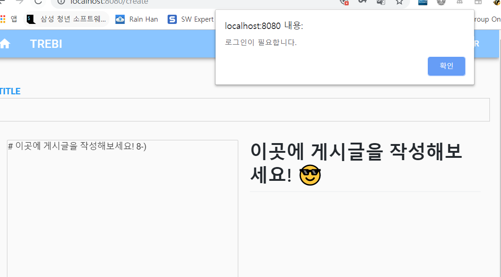

# README - by rain

## markdown editor

### router 설정 및 views vue 생성

1. `router.js`

   ```js
   import CreatePost from './views/CreatePost.vue'
   ...
   	{
         path: '/create',
         name: 'create',
         component: CreatePost
       }
   ```

   `CreatePost.vue` 를 만들기 위해 `/create` 주소를 생성한 후, component로 CreatePost를 지정

2. `views/CreatePost.vue`

   ```html
   <template>
     <div>
       <WMHeader></WMHeader>
       <WMFooter></WMFooter>
     </div>
   </template>
   ```

   ```js
   <script>
     import WMHeader from '../components/WMHeader'
     import WMFooter from '../components/WMFooter'
     export default {
       components: {
         WMHeader,
         WMFooter,
       }
     }
   </script>
   ```

   기본 골격을 잡아놓은 후, 안에 들어갈 markdown editor component 생성.


### markdown editor component 생성

1. [vue-simplemde](<https://github.com/F-loat/vue-simplemde>) 설치

   ```bash
   npm install vue-simplemde --save
   ```

2. npm init

   + 현재 환경설정 저장

3. `components/MarkdownEditor.vue`

   ```html
   <template>
       <div>
           <markdown-editor v-model="content" ref="markdownEditor"></markdown-editor>
           <button v-on:click="goHome" id="createButton">등록</button>
       </div>
   </template>
   ```

   ```js
   <script>
     import markdownEditor from 'vue-simplemde/src/markdown-editor'
   
     export default {
       components: {
         markdownEditor
       },
       data () {
         return {
           content: '',
           configs: {
             spellChecker: false // disable spell check
           }
         }
       },
       methods: {
           goHome: function(){
           alert('저장할게요!');
           location.replace('/');
           }
       }
     }
   </script>
   ```

   ```css
   <style>
     @import '~simplemde/dist/simplemde.min.css';
   </style>
   ```

   + methods는 임시로 root 페이지로 이동할 수 있게 해두었다.

4. `CreatePost.vue`

   ```html
       <MarkdownEditor></MarkdownEditor>
   ```

   div 안 원하는 위치에 추가.

   ```js
     import MarkdownEditor from '../components/MarkdownEditor'
     export default {
       components: {
         ...
         MarkdownEditor
       }
     }
   ```

   components에서 만든 MarkdownEditor를 import 해준다.

   


## firebase login

### vue와 firebase 바인딩

[github](<https://github.com/vuejs/vuefire/tree/v1>)

1. 사용할 것은 v1. 사용할 firebase 버전을 5.8로 올린다.

   `index.html`
   
   ```html
     <!-- Firebase -->
     <script src="https://gstatic.com/firebasejs/5.8.0/firebase.js"></script>
   ```
   ```html
   <!-- VueFire -->
   <script src="https://unpkg.com/vuefire/dist/vuefire.js"></script>
   ```
   ```html
     <!-- firebaseui-web -->
       <script src="https://cdn.firebase.com/libs/firebaseui/3.6.0/firebaseui.js"></script>
       <link type="text/css" rel="stylesheet" href="https://cdn.firebase.com/libs/firebaseui/3.6.0/firebaseui.css" />
   ```
   
   `index.html`
   
```html
       <script>
         // Initialize Firebase
         // TODO: Replace with your project's customized code snippet
         const config = {
           apiKey: "API_KEY",
           authDomain: "webmobile-sub2-510fa.firebaseapp.com",
           databaseURL: "https://webmobile-sub2.firebaseio.com",
           projectId: "webmobile-sub2-510fa",
         };
         firebase.initializeApp(config);
         const db = firebase.database()
         const auth = firebase.auth()
         const ui = new firebaseui.auth.AuthUI(auth)
       </script>
```

위 두가지를 head 위에 넣는다.


2. 위에 들어갈 내용들은 firebase 프로젝트를 하나 만들고 필요한 부분을 넣어준다.

   

3. `SignIn.vue`

   ```html
   <template>
     <div id="firebaseui-auth-container"></div>
   </template>
   ```

   ```js
   <script>
   export default {
     data() {
       return {
         currentUser: {
           uid: "",
           email: "",
           username: ""
         }
       };
     },
     methods: {
       initUI: function() {
         ui.start("#firebaseui-auth-container", {
           signInoptions: [firebase.auth.EmailAuthProvider.PROVIDER_ID],
           callbacks: {
             signInSuccessWithAuthResult: (authResult, redirectUrl) => {
               this.currentUser.uid = authResult.user.uid;
               this.currentUser.email = authResult.user.email;
               this.currentUser.username = authResult.user.displayName;
               return false;
             }
           }
         });
         
       }
       
     },
     mounted: function() {
       auth.onAuthStateChanged((user) =>{
           if (user) {
               this.currentUser.uid = user.uid
               this.currentUser.email = user.email
               this.currentUser.username = user.displayName
           }
           this.initUI()
       })
     }
   };
   </script>
   ```


### nav bar에 로그인/로그아웃 버튼 만들기

`WMHeader.vue`

```html
<template>
<div class="hide-overflow" style="position: relative;">
    ...
        <!-- 로그인 다이얼로그 활성화 -->
        <v-btn flat color="white" v-if="isLogin" @click="logout">Logout</v-btn>
        <v-btn flat color="white" v-else @click.stop="login_btn = true">Login</v-btn>
          <v-dialog v-model="login_btn" max-width="290">
            <v-card>
              ...

```

`isLogin`변수를 사용하여 true일때에는 logout버튼을, 반대의 경우에는 login 버튼을 나타나게 한다.

```js
<script>
import SignIn from "./SignIn";
export default {
  components: {
    SignIn
  },
  name: "WMHeader",
  data: () => ({
    ...
    isLogin: false
  }),
  methods:{
    showLoginDialog:function(){

    },
    logout: function() {
      this.currentUser = {
          uid: '',
          email: '',
          displayName: ''
      }
      auth.signOut()
    }
  },
  mounted: function(){
    auth.onAuthStateChanged(user => {
      if (user) this.isLogin=true;
      else this.isLogin=false;
    });
  }
};
</script>

```

`isLogin` 변수를 기본 false로 둔 후, mounted에서 현재 로그인 유저의 정보가 존재할 경우 true로, 아닐 경우 false로 수정한다.


### facebook login

1. [facebook for developers](<https://developers.facebook.com/>) 페이지에서 새로운 어플리케이션을 만들고 facebook 로그인 설정을 맞춰준다.

   

2. firebase authentication의 로그인 방법에서 facebook을 열고 1번의 설정에서 확인할 수 있는 앱 ID와 비밀번호를 등록한다.

   

   아래에 있는 OAuth 리디렉션 주소를 1번의 유효한 OAuth 리디렉션 URI로 등록해준다.

3. `SignIn.vue`

   ```js
     methods: {
       initUI: function() {
         ui.start("#firebaseui-auth-container", {
           signInoptions: [
             firebase.auth.EmailAuthProvider.PROVIDER_ID,
             {
               provider: firebase.auth.FacebookAuthProvider.PROVIDER_ID,
               scopes: [
                 'public_profile',
                 'email',
               ],
               customParameters: {
                 // Forces password re-entry.
                 auth_type: 'reauthenticate'
               }
             },
           ],
   ```

   firebase 로그인 `signInoptions`에 제공하는 provider를 facebook으로 추가하고, 받아올 scopes로 email과 프로필을 가져온다.

   

   

   다음과 같이 로그인을 할 수 있다.


### google 로그인

1. `SignIn.vue`

   ```js
     methods: {
       initUI: function() {
         ui.start("#firebaseui-auth-container", {
           signInoptions: [
             firebase.auth.EmailAuthProvider.PROVIDER_ID,
             {
               provider: firebase.auth.GoogleAuthProvider.PROVIDER_ID,
               authMethod: 'https://accounts.google.com',
               clientId: 'xxxxxxxxxxxxxxxxx.apps.googleusercontent.com'
             },
   ```

2. firebase authentication에서 로그인 방법에 google로그인 열기

   

   여기에서 나온 웹 클라이언트 ID를 1번의 clientId에 넣기


## sidebar

### check isLogin 

`WMsidebar.vue`

```html
          <v-list-tile-content>
            <v-list-tile-title><span id="user_name"></span>님 환영합니다!</v-list-tile-title>
            <v-list-tile-title v-if="isLogin" @click="$router.push('create')" id="create_post_button"><button id="createButton">글쓰기!</button></v-list-tile-title>
          </v-list-tile-content>

```

```js
mounted: function() {
    const userName = document.querySelector('#user_name')
    const createPost = document.querySelector('#create_post')
    auth.onAuthStateChanged(user => {
      if (user) {
        userName.innerText = user.displayName
        this.isLogin = true;

      } else{
        userName.innerText = 'guest'
        this.isLogin = false
      }
    });
  }
```

```css
#createButton{
  border: 1px solid pink;
  padding: 3px;
}
```

+ 현재 사용자의 이름을 보여주기 위해 id 태그로 span 태그를 선택. querySelector로 잡아서 innerText로 수정할 수 있게 만들었다.
+ 현재 로그인 된 사용자이면 글쓰기 버튼을 보여주고(v-if) 아닌경우에는 랜더링 되지 못하게 만들었다.
+ 버튼 클릭시 이동이 잘 구현되지 않아, `v-list-tile-title` 자체에 구현했다.

왼쪽 : 로그인 된 상태. 오른쪽 로그인 안된 상태


## firebase post에 writerPost 추가

1. `FirebaseService.js`

   ```js
     postPost(title, postWriter, content, image) {
       return firestore.collection(POSTS).add({
         title,
         postWriter,
         content,
         image,
       })
     },
   ```

   postWriter 추가

2. `store.js`

   ```js
   export default new Vuex.Store({
     state: {
       title: '',
       postWriter: '',
       content: '',
       image: ''
     },
   ```

   postWriter 추가

3. `components/WMPostlist.vue`

   ```html
   <v-layout mt-5 wrap>
     <v-flex v-for="i in posts.length > limits ? limits : posts.length" xs12 sm6 md3>
       <WMPost class="ma-3" :title="posts[i-1].title" :postWriter="posts[i-1].postWriter" :content="posts[i-1].content" :image="posts[i-1].image">
       </WMPost>
   ```

   postWirter 바인딩 추가

4. `componets/WMPost.vue`

   ```js
     props: {
       title: {
         type: String
       },
       postWriter: {
         type: String
       },
           ...
           
     methods: {
       viewPage() {
         this.$store.state.title = this.title,
         this.$store.state.postWriter = this.postWriter,
         this.$store.state.content = this.content,
         this.$store.state.image = this.image
         this.$router.push("/postview")
   ```

   props에 postWirter 추가

   methods에 postWirter 부분 추가.

5. `components/WMView.vue`

   ```html
       <p>
         <input class="w3-input w3-border" name="last" type="text" :value="this.$store.state.title" readonly/>
       </p>
       <p>
         작성자 : <input class="w3-input w3-border" style="display:inline; width:90%;" name="last" type="text" :value="this.$store.state.postWriter" readonly/>
       </p>
   ```

   작성자 부분 추가.


## 미로그인 사용자 글 작성 금지

`components/WMCreatePost.vue`

```js
  mounted:function() {
    auth.onAuthStateChanged(user => {
      if (user == null) {
        alert("로그인이 필요합니다.");
        window.location.assign('/');
      }
    });
  },
```

페이지가 로딩될 때 현재 유저가 존재하는지 확인. 아닐경우 알람창 다음에 루트페이지로 이동.




