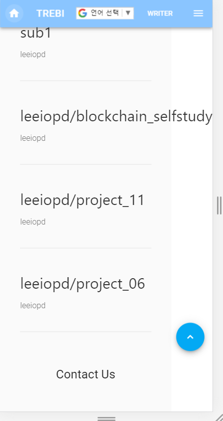
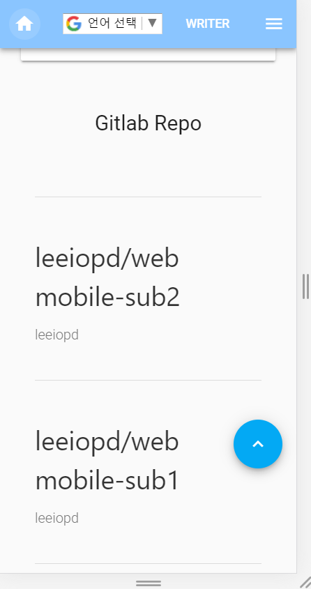

# README - mansub

> ## Footer

- vuetify

  Footer는 [vuetify 공식 사이트](https://vuetifyjs.com/en/components/footer)에서 사용.

* fontawesome

  github Icon은 [fontawesome](https://fontawesome.com/icons?d=gallery&q=github)에서 사용.

  - fontawesome CDN

    ```javascript
    script src="https://use.fontawesome.com/releases/v5.2.0/js/all.js"></script>
    ```

- navigator

아래와 같이 위도 경도를 요청할 수 있음.

보안 문제 때문에 **https**와 같은 곳에서 사용가능.

```javascript
navigator.geolocation.getCurrentPosition(position => {
  const lat = position.coords.latitude;
  const log = position.coords.longitude;
});
```

- openweatherMap

  [공식사이트](https://openweathermap.org/api)에서 회원가입하고나서 APIKEY발급

  - 요청 주소

    lat, lon, APPKEY 필요. 위에서 얻은 위도 경도를 입력해주면 날씨 정보 받을 수 있음.

    ```javascript
    http://api.openweathermap.org/data/2.5/weather?lat=${lat}&lon=${log}&APPID=${APPKEY}
    ```

* response Data

  fetch를 사용해서 데이터를 요청했으며 **then**을 사용해서 데이터를 처리함.

  온도는 절대온도이기 때문에 -273.15 해야함.  
  
  ```js
  getWeather: function(lat, log) {
        // open weather map
        fetch(
          `http://api.openweathermap.org/data/2.5/weather?lat=${lat}&lon=${log}&APPID=${APPKEY}`
        )
          .then(response => response.json())
          .then(json => {
            this.weather = json.weather[0].main;
            this.temp = Math.floor(json.main.temp - 273.15);
            if (json.name === "Taejŏn-gwangyŏksi") {
              this.place = "대전광역시";
            }
            /*eslint-disable*/
            console.log(this.weather);
            // console.log(this.temp, this.place, this.weather);
          });
  ```
  
  

- animation svg icon

  - [amchart](https://www.amcharts.com/free-animated-svg-weather-icons/) 에서 제공하는 svg파일로 애니메이션 날씨 아이콘을 구성했음.

  

---

> ## Gitlab Graph

[github](https://github.com/chromatixau/gitlab-network-graph)을 참고해서 따라했음.

위 github 프로젝트를 실행해서 만든 index.html 을 프로젝트에 직접 넣어서 사용했는데, 동기화를 해주는 것이 아니라 한번 생성한 그래프를 넣어주는 방식으로 사용했음.

bash에서 아래 명령어 작성 

```bash
../gitlab-network-graph/scripts/network.sh
```


- git clone을 하고나서 생기는 프로젝트에서 아래의 파일을 webmobile-sub2프로젝트에 넣어줌.


- 깃랩 그래프 컴포넌트 제작

  ```html
  <div
        class="network-graph"
        data-url=".data/data.json"
        data-commit-url="https///lab.ssafy.com/leeiopd/webmobile-sub2"
      ></div>
    </div>
  ```


---

> ## Gitlab API

- Repository 불러오기

  gitlab Private Repository를 가져오기 위해서는 [personaltoken](https://docs.gitlab.com/ee/user/profile/personal_access_tokens.html)를 발급받아서 사용해야함.

  **\${userName}** 에 **gitlab id** 를 입력하면 됨.

  ```js
  https://lab.ssafy.com/api/v4/users/${userName}/projects?private_token=프라이빗토큰
  ```

- Commits 불러오기

  **\${fullName}**에 **repository id**를 넣어야함.

  **Master Branch**이외에는 커밋이 한개만 불러지는 이슈가 있음.

  ```js
  https://lab.ssafy.com/api/v4/projects/${fullName}/repository/commits?private_token=프라이빗토큰
  ```

---

> ## 이미지 업로더 컴포넌트로 분리

- 쉽게 보기 위해 **Style**을 제거한 이미지 업로더 컴포넌트

```vue
//ImgUpload.vue

<template>
  <div>
    <div class="filebox" v-if="!image">
      <label for="uploadFile">파일 선택</label>
      <input type="file" @change="onFileChange" id="uploadFile" />
    </div>
    <div v-else>
      
    </div>
  </div>
</template>
```

위 코드를 보면 **파일선택**을 눌러서 **type="file"**인 input의 value가 바뀌게 되면 `@change`를 호출하게 됨.

```vue
//ImgUpload.vue

<script>
export default {
  name: "ImgUpLoad",
  data() {
    return {
      image: ""
    };
  },
  methods: {
    removeImage() {
      this.image = "";
    },
    onFileChange(e) {
      // file 세팅
      let files = e.target.files || e.dataTransfer.files;
      console.log(files);
      if (!files.length) {
        return;
      }
      const apiUrl = "https://api.imgur.com/3/image";
      const apiKey = "5139c8830e24c39";

      let data = new FormData();
      let content = {
        method: "POST",
        headers: {
          Authorization: "Client-ID " + apiKey,
          Accept: "application/json"
        },
        body: data,
        mimeType: "multipart/form-data"
      };

      data.append("image", files[0]);

      fetch(apiUrl, content)
        .then(response => response.json())
        .then(success => {
          this.image = success.data.link;
          console.log(this.image);
          this.$emit("upLoadImg", this.image);
        })
        .catch();
    }
  }
};
</script>
```

위 코드의 대부분은 이미지 업로드를 하고 데이터를 받아오는 동작을하고 있음.

아래쪽을 보면 `this.$emit("upLoadImg", this.image);`라는 코드가 있는데 이것이 상위 컴포넌트에게 이벤트 이름은 **UpLoadImg**이고 argument로는 **this.image**를 갖고 있는 이벤트를 보내게 됨.

```vue
//CreatePostPage.vue

<template>
  (...중략...)
  <ImgUpLoad v-on:upLoadImg="upLoadImg"></ImgUpLoad>
  (...중략...)
</template>
```

위에는 이미지 업로더 컴포넌트를 갖고 있는 게시물 업로드하는 컴포넌트임. 하위 컴포넌트에서 **upLoadImg**라는 이벤트가 발생하면 **UpLoadImg**가 발생할 수 있게 연결해놓는 것임.

하위 컴포넌트가 상위컴포넌트에게 이벤트 발생 알림 -> 상위 컴포넌트는 하위컴포넌트의 이벤트와 연결된 함수 호출.

상위 컴포넌트의 **upLoadImg**함수

- argument로 들어온 image를 자신의 data에 있는 this.image에 넣어줌.

```vue
upLoadImg(image) { console.log("업로드 : ", image); this.image = image; }
```


> ### repository 명 자동개행 시키기 


repository 명이 아래와 같이 overflow되는 이슈가 있었음. 



 	

* 해결책 

  ```vue
  <template>
    <div class="py-3">
          <a target="_blank" v-bind:href="repos.http_url_to_repo">
            <h2 class="repoTitle font-weight-regular">{{repos.path_with_namespace}}</h2>
          </a>
    </div>
  </template>
  
  (...중략...)
  
  <style scoped >
  
  .repoTitle {
    word-break: break-all;
  }
  </style>
  
  ```

  repoTitle 클래스를 주고 `word-break: break-all` 속성을 주어서 해결했음.  해당 속성은 띄어쓰기가 없더라도 강제로 개행을 해주는 기능을 함.  

  